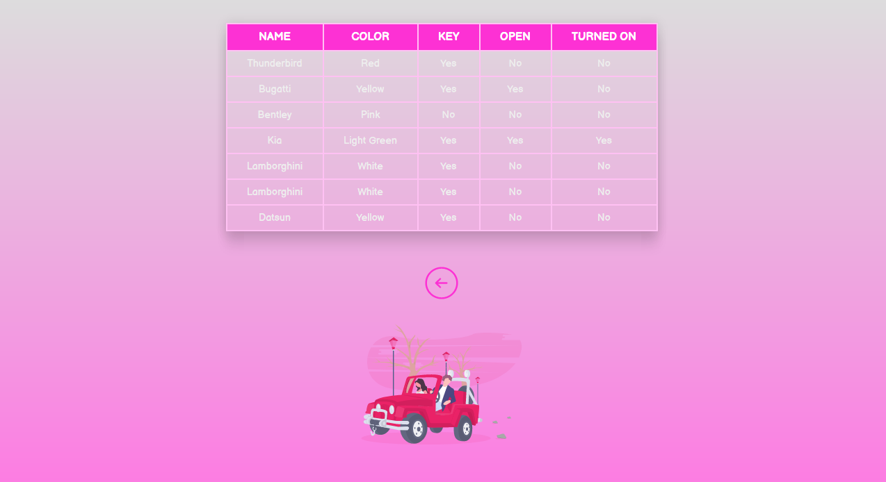

<h1 align="center">Object-Oriented Programming | PHP </h1> 

  <a href="#computer-technologies">Technologies</a>&nbsp;&nbsp;&nbsp;|&nbsp;&nbsp;&nbsp;
  <a href="#octocat-projects">Project</a>

 

  

## :computer: Technologies

This project was developed with the following technologies:

- [HTML](https://developer.mozilla.org/en-US/docs/Web/HTML)
- [CSS](https://developer.mozilla.org/en-US/docs/Web/CSS/)
- [PHP](https://www.php.net/docs.php)

## :octocat: Projects

This repository was created for improving and fixing our knowledge about OOP using PHP. In the homepage, we can fill a form and send the data (using an object instance).

---

Made with :heartbeat: by [AbnerLago](https://www.abnerlago.com/) 